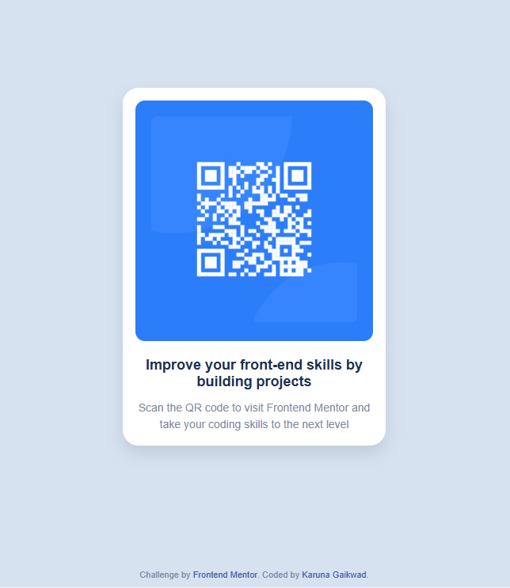

# Frontend Mentor - QR Code Component Solution

This is my solution to the QR code component challenge on Frontend Mentor. This challenge helped me practice building a simple, responsive layout using HTML and CSS.

---

## 📌 Overview

### 📸 Screenshot



---

### 🔗 Links

* Solution URL: https://karunagaikwadpersonal.github.io/qr-code/
* Live Site URL: https://karunagaikwadpersonal.github.io/qr-code/

---

## ⚙️ My Process

### 🛠️ Built With

* Semantic HTML5
* CSS custom properties
* Flexbox
* Mobile-first workflow

---

### 📚 What I Learned

While working on this project, I improved my understanding of:

* Structuring HTML semantically
* Centering elements using Flexbox
* Creating responsive layouts
* Using consistent spacing and alignment

Example of centering with Flexbox:

```css
body {
  display: flex;
  justify-content: center;
  align-items: center;
  height: 100vh;
}
```

---

### 🚀 Continued Development

In future projects, I want to:

* Improve my responsive design skills
* Write cleaner and more reusable CSS
* Practice more Frontend Mentor challenges

---

### 📖 Useful Resources

* https://developer.mozilla.org/ – Great for understanding HTML & CSS
* https://css-tricks.com/ – Helped with Flexbox concepts

---

### 🤖 AI Collaboration

I used ChatGPT to:

* Debug Git and deployment issues
* Understand how to deploy using GitHub Pages
* Improve my README structure

It helped speed up problem-solving and clarified concepts quickly.

---

## 👩‍💻 Author

* GitHub: https://github.com/KarunaGaikwadPersonal
* Frontend Mentor: https://www.frontendmentor.io/profile/KarunaGaikwadPersonal

---

## 🙌 Acknowledgments

Thanks to Frontend Mentor for providing this challenge and helping improve my frontend skills.
